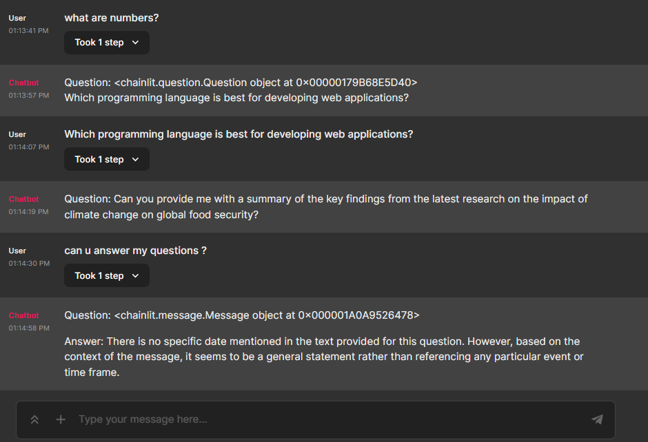

**README: Question-Answering System with Zephyr-7B Model**

**Introduction:**

This repository contains a Python script for building a question-answering system using the Zephyr-7B model. The system is built on top of several libraries, including `chainlit`, `langchain`, and `CTransformers`. This script enables developers to create interactive conversational interfaces capable of understanding and responding to user queries effectively.

**Prerequisites:**

Before using the script, ensure you have the following libraries installed:

- `os`
- `chainlit`
- `langchain`
- `torch`

Additionally, download the appropriate Zephyr-7B model from the provided link based on your system specifications.

**Setting Up the Environment:**

1. **Install Required Libraries:**
   ```
   pip install os torch chainlit langchain
   ```

2. **Download the Zephyr-7B Model:**
   - Choose the model file matching your system specifications from the provided link.
   
   Link : https://huggingface.co/TheBloke/zephyr-7B-alpha-GGUF/blob/main/zephyr-7b-alpha.Q8_0.gguf
   
   - Place the downloaded model file in the same directory as the script.

**Usage:**

1. **Configuration:**
   - Modify the `config` dictionary to adjust the behavior of the question-answering system. Parameters such as `max_new_tokens`, `repetition_penalty`, `temperature`, `top_k`, `top_p`, `stream`, and `threads` can be customized according to your requirements.

2. **Template Setup:**
   - Adjust the `template` variable to define the format of the questions and corresponding answers. The system will generate responses based on this template.

3. **Run the Script:**
   - Execute the script, and the question-answering system will start.
   - User queries can be sent as messages to the running system. The system will respond with appropriate answers based on the Zephyr-7B model's predictions.

**Usage Example:**

```python
chainlit run app.py
```

**Important Notes:**

- Ensure that the model file (`zephyr-7b-alpha.Q8_0.gguf` or your chosen model) is placed in the same directory as the script.
- Keep the necessary configurations and template updated as per your application's requirements for accurate and relevant responses.


**Demonstration**


**Credits:**

This project utilizes the capabilities of `chainlit`, `langchain`, and `CTransformers` libraries, providing a robust foundation for building advanced conversational AI systems. Special thanks to the developers and contributors of these libraries for their valuable work.

For more information about these libraries and the Zephyr-7B model, refer to their respective documentation and repositories. Happy coding!